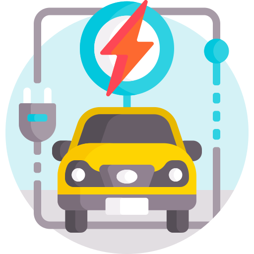
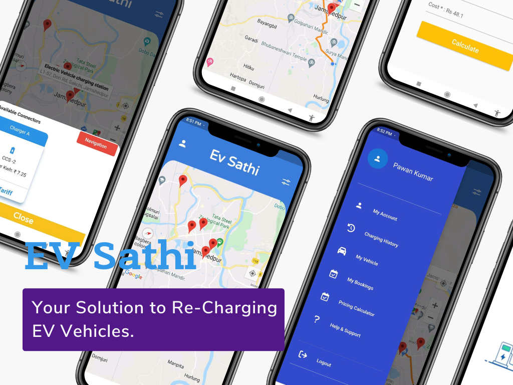
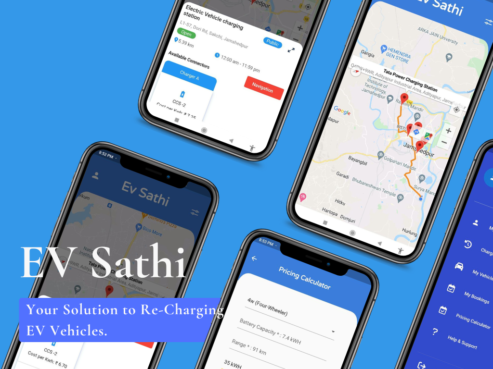

<br />
<div align="center">
  <a href="https://github.com/TheSpeedX/EV-Sathi/">
    
  </a>
  <h1 align="center"><b>EV-Sathi</b></h1>

  <p align="center">
    Your Solution to Re-Charging EV Vehicles.
    <br />
  </p>
  <br />


  
<br />
<a href="https://www.youtube.com/watch?v=qD1OsIGTaZE">View Demo</a>
·
<a href="https://github.com/TheSpeedX/EV-Sathi/issues">Report Bug</a>
·
<a href="https://github.com/TheSpeedX/EV-Sathi/issues">Request Feature</a>
</div>

<!-- TABLE OF CONTENTS -->
<details open="open">
  <summary>Table of Contents</summary>
  <ol>
    <li>
      <a href="#why-ev-sathi-">Why EV-Sathi</a>
    </li>
    <li>
      <a href="#about-the-project">About The Project</a>
    </li>
    <li>
      <a href="#Key-Features-Implemented">Key Features Implemented</a>
    </li>
    <li>
      <a href="#tech-stacks">Tech Stacks</a>
    </li>
    <li>
      <a href="#getting-started">Getting Started</a>
    </li>
    <li><a href="#app-screenshots">App ScreenShots</a></li>
    <li><a href="#contributing">Contributing</a></li>
    <li><a href="#license">License</a></li>
    <li><a href="#contact">Contact</a></li>
  </ol>
</details>

## Why EV-Sathi ?

We examine a new, upcoming generation of vehicles that run on electric power supplied by onboard batteries in a smart city environment. Charging at home and in public areas are the best recharging option. As charging stations are shared resources, Cooperating EVs have the potential to avoid unbalanced use of charging stations and long wait times.

India has seen a significant increase in the number of electric vehicles (EVs) since the past year. Yet the EV owners still face trouble while trying to recharge their vehicles.

## About The Project

<div align="center">

</div>

Suppose you are a EV owner, you are out on a trip and you suddenly realise that you have to recharge your EV. You are not sure where to recharge your EV. You are not sure if the EV charging station is open or has the suitable charger for your vehicle. This is where EV-Sathi comes in.

Our application uses a cost-effective solution for EV owners to find the nearest charging station and recharge their vehicles. It also supports booking of charging stations for those who want to recharge their vehicles at a scheduled time.The dynamic nature of the application makes it easy to manage multiple vehicles from one device.


### Key Features Implemented

- Awesome UX and easy to use friendly interface

- Manage multiple vehicles from one device

- Find the charging stations near you in a Built-in Map with real-time location updates

- Get status of EV charging stations along with distance, chargers, etc.

- Get a dyanamic price while booking slot for your EV based on currently free slots.

- Navigation system to help you find the charging station in a short time using Direction and Places API.

- View booking history of your EV

- Estimate cost and time for your EV in a journey with an awesome Pricing Calculator.

### Tech Stacks

**Mobile Applicaton:**

- Flutter
- Firebase
- Firestore Database
- Google Cloud Platform
- Google Maps API
- Places API
- Direction API

**Dynamic Pricing:**
- ML Model used- Multi-Regression Model, Genetic Algorithm
- Dataset used- EV Station pricing dataset, Real-time Queue at the EV Station based on Maps API data.

## Getting Started

You can test Ev Sathi in your own development environment. This section shows you how:

## Prerequisites

You'll need to set up the IDE and mobile device emulator, or any mobile testing device on your local system.

## Prerequisites

You'll need to set up the IDE and mobile device emulator, or any mobile testing device on your local system.

**Flutter Environment: You'll need to have the following installed:**

1. [Flutter SDK](https://flutter.dev/docs/get-started/install)
2. [Android Studio](https://developer.android.com/studio)

***Ensure you are testing the app using Flutter version [2.10.3](https://docs.flutter.dev/development/tools/sdk/releases?tab=windows) and above.***

*For checking flutter version:*

- Run flutter --version in terminal

If your version is not upto date, follow these steps to upgrade:

- flutter channel stable to switch to the channel having stable version of flutter updates
- flutter upgrade to get the latest flutter version

### *Development Environment: For setting up the development environment, follow the steps given below.*

- Clone this repository after forking using git clone <https://github.com/TheSpeedX/EV-Sathi.git>
- cd into `EV-Sathi`
- Check for flutter setup and connected devices using `flutter doctor`
- Get all the dependencies using `flutter pub get`
- Go Inside `lib --> screen --> contsant` .
- Place your Google Map API Key.
- How To Get Google Map API Key? For setting the Map, follow the steps given below.

  1. [Sign In to Google Account](https://accounts.google.com/servicelogin).
  2. [Go To Google Console](https://console.cloud.google.com/).
     - Enable Direction Api.
     - Enable Places Api.
  3. [Go to Credentials](https://console.cloud.google.com/apis/credentials)
  4. Click on create credentials.
  5. Copy the API Key.

- **Run the app using `flutter run`**

For help getting started with Flutter, view our
[online documentation](https://flutter.dev/docs), which offers tutorials,
samples, guidance on mobile development, and a full API reference.

## Project Structure

This project follows MVVM architecture with following structure:

```text
EV-Sathi/lib/
├── components/                                    # resuable widget i.e buttons,card,error dialog,loading dialog, marker design, text field.
     ├── button.dart
     ├── button_nav_route.dart
     ├── card.dart
     ├── errordialog.dart
     ├── loading_dialog.dart
     ├── on_marker_tap.dart
     ├── textfiled.dart
     └── progress_bar.dart                           
├── models/   
     └── nearby_ev_station_results.dart      # model class for fetching the near by ev station.                     
├── otp/                            # Widgets Involved in Designing OTP Screen, Sending OTP To user,verifying otp and logging them sucessfully.
      ├── components/
      └── ....
      ├── newuser/
      └──....
      └── olduser.dart
├── screen/           #Various screen involved.
      ├── auth/ 
      └── ....      #screen involved in authorization i.e, login, sign in.
      ├── constant/
      └── ...          #constant needed by auth screen
      ├── marker_container/
      └── ...                    # Designing Maker Container.
      ├── profile_screen/
      └── ...                   #screen involved in Profiling.
      ├── splash/
      └── ...                  #screen involved in Splash Screen..
      ├── vechile_add/
      └── ...                  #screen involved in Vechile Addition.
      ├── dashboard.dart        # main part of driving functionality.
      └── map_page.dart         # Map Page.  
├── sidebar/                              
|   ├── components/  
    └── ...             # screen involved in side drawer
|   └── drawaer.dart/         # main part of drawer.                   
├── constant.dart/            #constant needed by splash screen.
├── global.dart/              #global file needed for all Widget.             
├── routes.dart               #routes for Screens.   
├── size_config.dart          #size config for reponsivness.
└── main.dart                  # Heart of this App.
```

## APP Screenshots

<div align="center">

</div>

[](https://youtu.be/L6JABaiIMrI)

[](https://youtu.be/L6JABaiIMrI)


### View Demo

[](https://youtu.be/L6JABaiIMrI)


## Contributing

Contributions are what make the open source community such an amazing place to be learn, inspire, and create. Any contributions you make are **greatly appreciated**.

1. Fork the Project
2. Create your Feature Branch (`git checkout -b feature/AmazingFeature`)
3. Commit your Changes (`git commit -m 'Add some AmazingFeature'`)
4. Push to the Branch (`git push origin feature/AmazingFeature`)
5. Open a Pull Request

## License

Distributed under the MIT License. See `LICENSE` for more information.

## Contact

Team Name - Team Stellar Hackers **(HackStack Hackathon 2022)**

Project Link: [https://github.com/TheSpeedX/EV-Sathi/](https://github.com/TheSpeedX/EV-Sathi/)

Youtube link: [https://www.youtube.com/watch?v=qD1OsIGTaZE](https://youtu.be/L6JABaiIMrI)

Made with ♥ by Team Stellar Hackers


